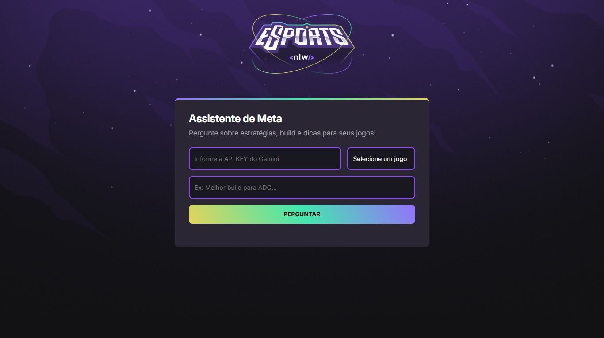

# 🧠 NLW Agents – Assistente de IA para Games Competitivos

Projeto desenvolvido durante a **Next Level Week (NLW)** promovida pela Rocketseat.

**NLW Agents** é um assistente virtual inteligente que fornece **dicas, estratégias e builds** atualizadas para jogos como **League of Legends**, **Valorant** e **CS:GO**, utilizando a API **Gemini** da Google.

---

## ✨ Funcionalidades

- ✅ Respostas rápidas e contextualizadas com IA generativa
- 🧠 Integração com o meta atual dos jogos
- 🎮 Suporte para League of Legends, Valorant e CS:GO
- 🔐 Requisições com API Key segura da Google Cloud
- 📄 Interface leve com suporte a markdown (Showdown.js)

---

## 📸 Screenshot



---

## 🚀 Tecnologias Utilizadas


---

## 🔐 Como Obter a API Key da Gemini

Para utilizar a IA generativa da Google (Gemini), você precisa de uma chave de API:

1. Acesse [Google AI Studio](https://aistudio.google.com/app/apikey).
2. Faça login com sua conta Google.
3. Crie um novo projeto ou selecione um já existente.
4. Vá em **“APIs e Serviços” → “Biblioteca”** e ative a **Generative Language API**.
5. Em **“Credenciais”**, crie uma nova chave de API.
6. Copie a chave e use-a no campo solicitado na aplicação.

⚠️ **Importante:**
- **Não compartilhe** sua chave publicamente.
- Verifique os **limites e custos** associados ao uso da API.
- Consulte a [documentação oficial da Gemini](https://developers.generativeai.google/) para detalhes técnicos.

---

## 🧪 Como Usar

Clone este repositório e rode localmente:

```bash
git clone https://github.com/kaueaclima/nlwAgents.git
cd nlwAgents
